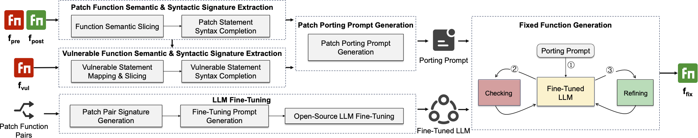

| 🎉News:  9-22 2024 Mystiqe successfully ported patches of 16 CVEs in C and Java repositories, and submitted 34 PRs to those repositories. 29 of the 34 PRs have been successfully merged into the repository branches or related forked branches.

# Mystique

Mystique is a novel approach utilizing a fine-tuned Large Language Model (LLM) to address the challenges of patch porting in software development. It extracts semantic and syntactic signatures from both the original patched function and the target vulnerable function, guiding the LLM to generate a fixed function. Mystique's iterative checking and refining process ensures high accuracy and successful porting, significantly outperforming existing methods in terms of success rates. Our evaluation shows that Mystiqe achieved a success rate of 0.954 at function level and of 0.924 at CVE level, outperforming state-of-the-art approaches by at least 13.2% at function level and 12.3% at CVE level. Our evaluation also demonstrates Mystiqe’s superior generality across various projects, bugs, and programming languages.

# Dependencies

- Python - 3.11+
- Joern - 2.260
- Tree-sitter - 0.22.6
- Clang-Tidy - 14.0.0

# Methodology Implementation

The key idea of Mystiqe is to extract the semantic and syntactic vulnerable and fixed signatures of the patch from the original branch at function level, then extract the corresponding vulnerable function signature of the vulnerable function from the target branch at function level, guiding the fine-tuned large language model (LLM) to generate a fixed function. Since LLM may not always produce accurate results, Mystiqe incorporates an iterative checking and refining process, enhancing the success rate of patch porting. Finally, Mystiqe outputs the final fixed function.

[The Prototype of Mystiqe](https://github.com/Mystique-OpenSource/mystique-opensource.github.io/tree/main/src).

# Data

In Effectiveness Evaluation, we choose C projects to construct the ground truth. The ground truth is established through a rigorous examination process.

1. Collecting Vulnerabilities and Patches: Vulnerabilities were gathered from CVE/NVD databases between January 2014 and May 2024, focusing on repositories written in C.
2. Expanding Vulnerabilities and Patches: Additional vulnerabilities and patches were integrated from the TSBPORT dataset. Commit history was analyzed, and patches were expanded based on criteria like identical code or matching commit messages. This expanded the dataset to [7,532 CVEs with 15,478 patches](./data/initial_cve_full.json).
3. Selecting CVE Patch Pairs: Following the PPatHF method, unrelated commits were filtered out, and patches affecting non-C code or functions were excluded. For each vulnerability, the earliest and latest commits were selected to form CVE patch pairs. Vulnerabilities with only a single patch were excluded.

As a result, we collected 3,536 CVEs across 33 different repositories. We release the collected data: [CVE C Patch Dataset](./data/cve-c-patch.json) with [Kappa](./eval/kappa/cve_patches_with_mark.xlsx) of 0.981.

We release the collected data: [Bug Patch Dataset](./data/bug.json)

To extend the evaluation to another programming language, we constructed a Java vulnerability patch porting dataset. Following the strategy used for C vulnerabilities and bugs, we collected and curated 61 confirmed Java vulnerability-fixing commit pairs with their 204 functions. This evaluation allows us to assess Mystiqe’s ability to generalize across different programming languages.
We release the collected data: [CVE Java Patch Dataset](./data/cve-java.json)

# Baseline

- FixMorph: https://github.com/rshariffdeen/FixMorph
- TSBPORT: https://sites.google.com/view/tsbport
- PPatHF: https://github.com/ZJU-CTAG/PPatHF
- GPT: https://platform.openai.com
- CodeLlama: https://github.com/meta-llama/codellama
- StarCoder: https://github.com/bigcode-project/starcoder

# Evaluation

The metrics of Exactly Match (E-M) and Success (Succ) to evaluate patch porting quality. E-M refers to the automatically ported patches that are identical to the manually ported patch, while Succ refers to automatically ported patches that are semantically equivalent to the manually ported patches.

You can use our [Evaluation Toolkit](https://github.com/Mystique-OpenSource/mystique-opensource.github.io/tree/main/eval) to assess [All the Ported Patch Results](./eval/results/generated_patch).

- RQ1(Effectiveness): We assessed Mystiqe using the ground truth, and compared its performance with baseline approaches. See [RQ1 results](./eval/results/baseline.json).
    - run `python evaluate.py ours_merge function` point Table 2 in RQ1
- RQ2(Ablation): We created three ablated versions of Mystiqe (w/o Signature, w/o Tuning, w/o Refine). See [RQ2 results](./eval/results/ablation.json).
    - run `python ablation.py noslice/noft/norf function` point Table 3 in RQ2
- RQ3(Sensitivity): you should first cd the folder of sensitivity:
    - run `python sensitivity_slice_draw.py` point Figure 6(a) in RQ3
    - run `python sensitivity_ov_draw.py` point Figure 6(b) in RQ3
    - run `python sensitivity_ud_draw.py` point Figure 6(c) in RQ3
    - run `python sensitivity_token_draw.py` point Figure 6(d) in RQ3
- RQ4(Generality): To thoroughly evaluate the generality of Mystiqe, we designed three generality experiments by applying Mystiqe across different [Projects](./eval/results/train_linux_test_others.json), [Bugs](./eval/results/across_bug.json), and [Programming Languages](./eval/results/across_lang.json).
    - run `python evaluate.py train_linux_test_others/train_others_test_linux function` point Table 4 in RQ4
    - run `python evaluate.py bug function` point Table 5 in RQ4
    - run `python evaluate.py java function` point Table 6 in RQ4
- RQ5(Efficiency): We measured the average time taken to port patch for each CVE as well as for each function. See [RQ5 results](./eval/results/efficiency.json).
- RQ6(Usefulness): Mystiqe successfully ported patches of 16 CVEs in C and Java repositories, and submitted 34 PRs to those repositories. 29 of the 34 PRs have been successfully merged into the repository branches or related forked branches.
